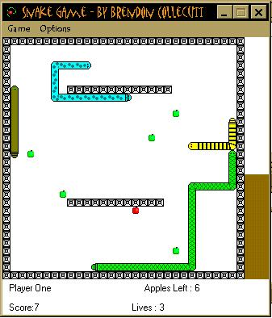

<div align="center">

## My Snake Game


</div>

### Description

Cool little snake game I made. Better than all the other ones I've seen on psc. Play two player or one player with five different speeds and up to four computer players. I've commented it the best I can. There are heaps of little examples like playings sounds accessing files etc. Plz vote for it and comment! thx
 
### More Info
 


<span>             |<span>
---                |---
**Submitted On**   |2001-12-31 15:43:30
**By**             |[Brendon Collecutt](https://github.com/Planet-Source-Code/PSCIndex/blob/master/ByAuthor/brendon-collecutt.md)
**Level**          |Intermediate
**User Rating**    |4.8 (38 globes from 8 users)
**Compatibility**  |VB 6\.0
**Category**       |[Games](https://github.com/Planet-Source-Code/PSCIndex/blob/master/ByCategory/games__1-38.md)
**World**          |[Visual Basic](https://github.com/Planet-Source-Code/PSCIndex/blob/master/ByWorld/visual-basic.md)
**Archive File**   |[My\_Snake\_G45457112002\.zip](https://github.com/Planet-Source-Code/brendon-collecutt-my-snake-game__1-30264/archive/master.zip)

### API Declarations

```
BitBlt(ByVal hDestDC As Long, ByVal x As Long, ByVal y As Long, ByVal nWidth As Long, ByVal nHeight As Long, ByVal hSrcDC As Long, ByVal xSrc As Long, ByVal ySrc As Long, ByVal dwRop As Long) As Long
GetTickCount() As Long
sndPlaySound (ByVal lpszSoundName As String, ByVal uFlags As Long) As Long
```


